<div align="center">

# Project-6 · Hybrid Identity & Endpoint Management

**Windows Server Active Directory synchronized with Microsoft Entra ID, with Intune-managed endpoints and Conditional Access.**


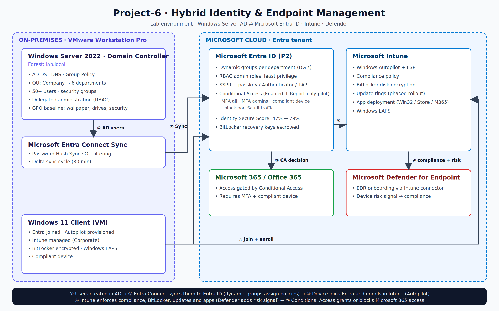

</div>

---

## Overview

A lab that simulates a mid-size enterprise: an on-premises Active Directory forest synchronized to Microsoft Entra ID, with cloud identity security and fully managed Windows endpoints.

| Area | What was built |
|---|---|
| **Directory** | `lab.local` forest, OU structure with 6 departments, 50+ users, security groups, GPO baseline |
| **Hybrid identity** | Entra Connect Sync with OU filtering and Password Hash Sync |
| **Cloud identity** | Dynamic groups, admin roles with least privilege, SSPR, modern auth methods |
| **Access control** | Conditional Access: MFA, admin MFA, compliant-device requirement, geo restriction |
| **Endpoints** | Autopilot provisioning, compliance, BitLocker, update rings, app deployment, Windows LAPS |
| **Result** | Identity Secure Score improved from **47% to 79%** |

> **Scope:** this is a lab environment built on VMware Workstation Pro, designed with the structure and controls used in large enterprise deployments.

---

## Environment

| Component | Details |
|---|---|
| Virtualization | VMware Workstation Pro |
| Domain controller | Windows Server 2022 (AD DS, DNS, Group Policy) |
| Sync | Microsoft Entra Connect Sync |
| Cloud | Microsoft Entra ID P2, Microsoft Intune (Microsoft 365 E5 trial) |
| Client | Windows 11 VM (Entra joined, Intune managed) |

---

## 1. Active Directory

Designed an OU tree by department, with users and security groups organized for delegation and policy targeting. A GPO baseline applies the corporate wallpaper and standard settings across all domain devices.

<table>
<tr>
<td width="50%">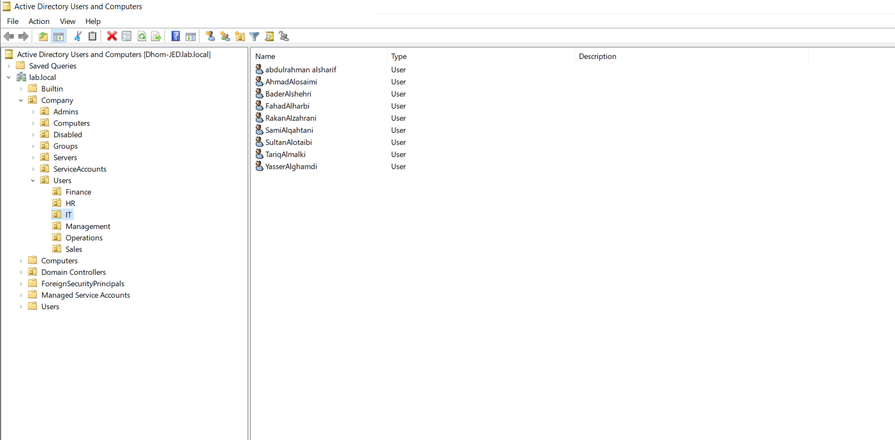<br><sub><b>OU structure:</b> Company OU with 6 departments</sub></td>
<td width="50%">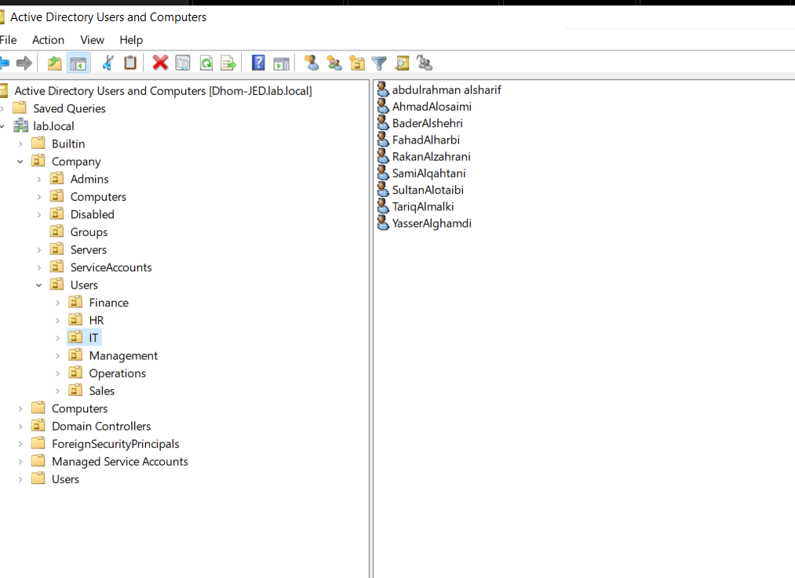<br><sub><b>Users:</b> 50+ accounts across departments</sub></td>
</tr>
</table>

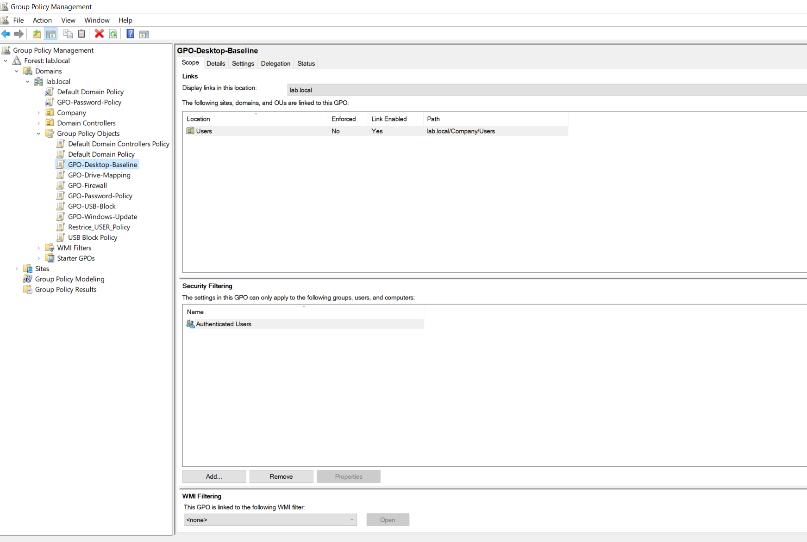
<br><sub><b>Group Policy:</b> baseline GPOs linked to the relevant OUs</sub>

---

## 2. Hybrid Identity (Entra Connect)

- Synchronizes only the `Company` OU (OU filtering), keeping service and admin objects out of the cloud.
- Password Hash Sync enabled; delta sync verified end to end.
- Synced users appear in Entra ID with source **Windows Server AD**.


<br><sub><b>Sync status and OU filtering</b></sub>

---

## 3. Identity & Access Security

- **Dynamic groups** per department assign membership automatically from the synced `department` attribute.
- **SSPR** and modern authentication methods (passkey, Authenticator, Temporary Access Pass); SMS disabled.
- **Conditional Access** policies validated in Report-only mode first, with What If analysis before enforcement.

<table>
<tr>
<td width="50%">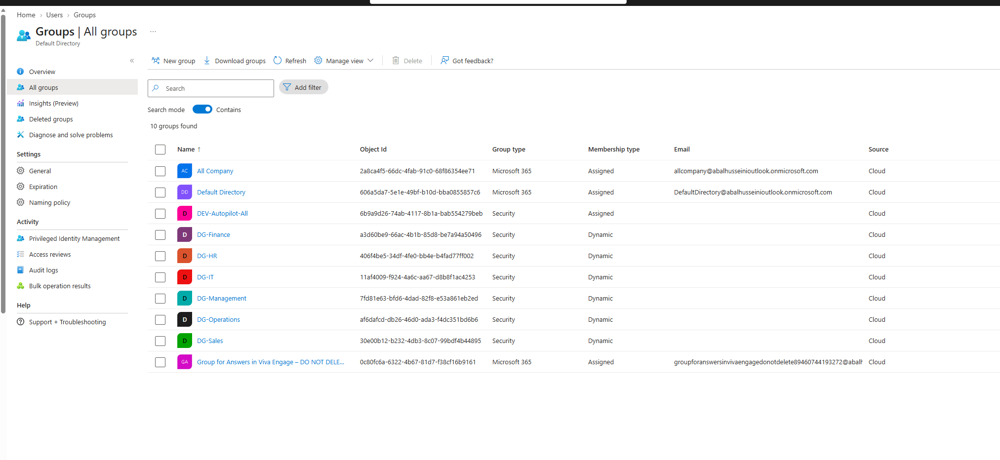<br><sub><b>Dynamic groups</b> per department</sub></td>
<td width="50%">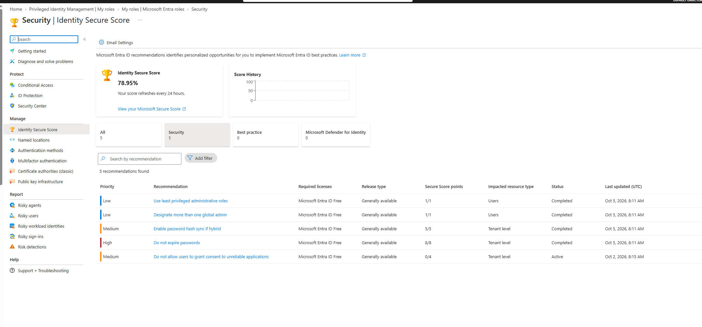<br><sub><b>Identity Secure Score:</b> 47% to 79%</sub></td>
</tr>
<tr>
<td width="50%">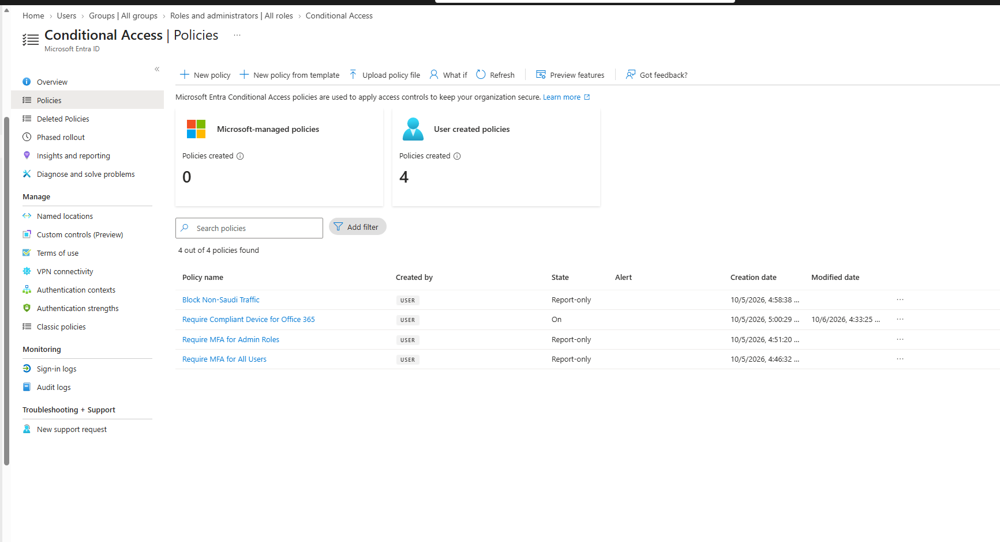<br><sub><b>Conditional Access policies</b></sub></td>
<td width="50%">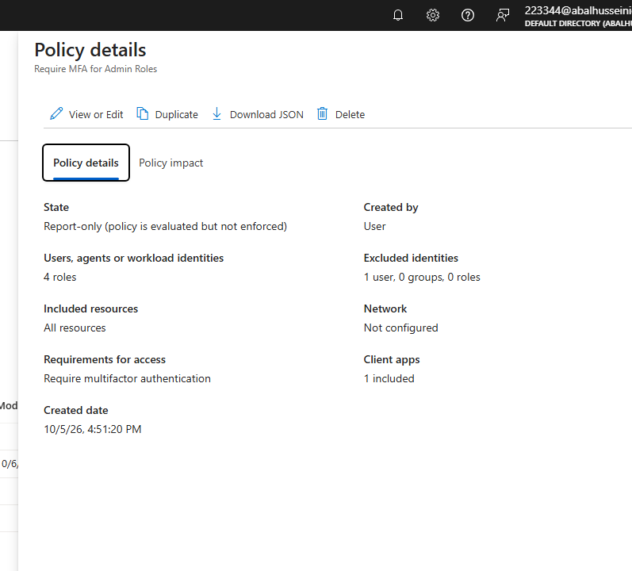<br><sub><b>MFA for admin roles</b> with break-glass exclusion</sub></td>
</tr>
</table>

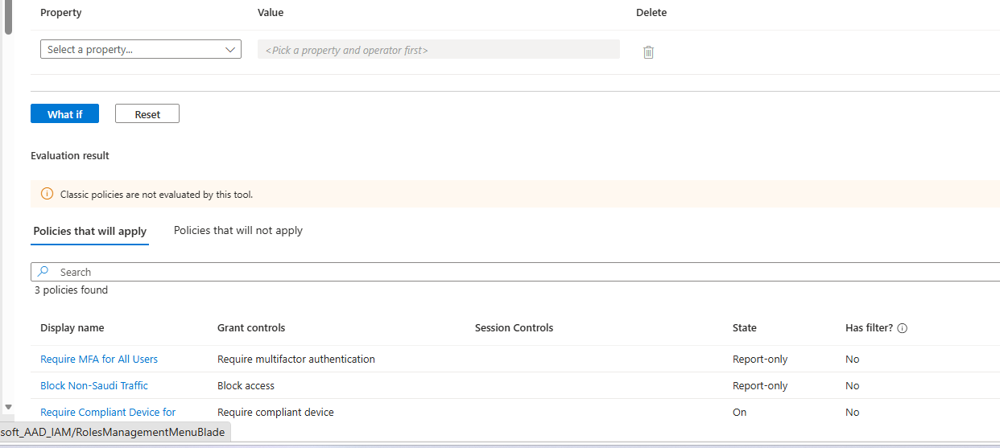
<br><sub><b>What If:</b> policy evaluation proof</sub>

| Policy | Purpose |
|---|---|
| Require MFA for all users | Baseline protection |
| Require MFA for admin roles | Protect privileged accounts |
| Require compliant device for Office 365 | Tie access to Intune compliance |
| Block non-Saudi traffic | Geo restriction |

---

## 4. Endpoint Management (Intune)

Provisioning, security and lifecycle for Windows devices are managed from the cloud:

- **Autopilot:** the device receives its profile and configuration at first sign-in.
- **Compliance:** policy defines a healthy device; Conditional Access enforces it.
- **BitLocker:** silent encryption with recovery keys escrowed in Entra ID.
- **Update rings:** phased rollout to limit the impact of bad updates.
- **Apps:** required apps deployed automatically.
- **Windows LAPS:** unique, rotated local administrator password per device.

<table>
<tr>
<td width="50%">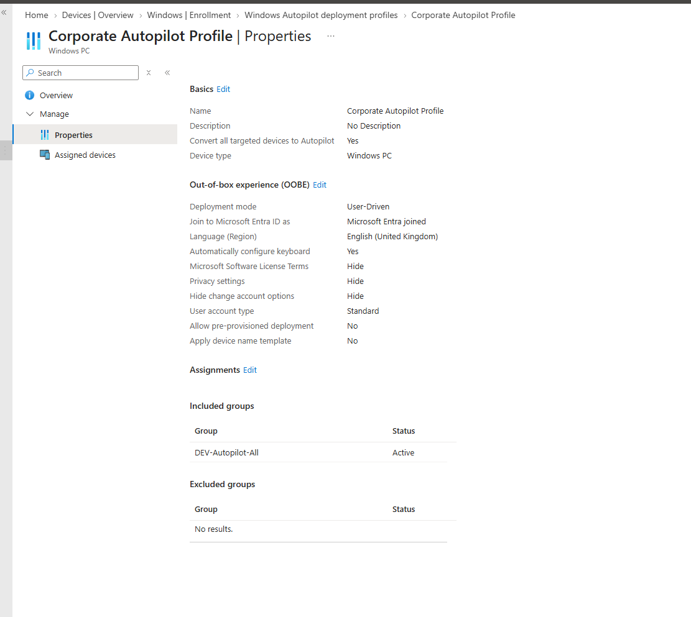<br><sub><b>Autopilot</b> device and deployment profile</sub></td>
<td width="50%">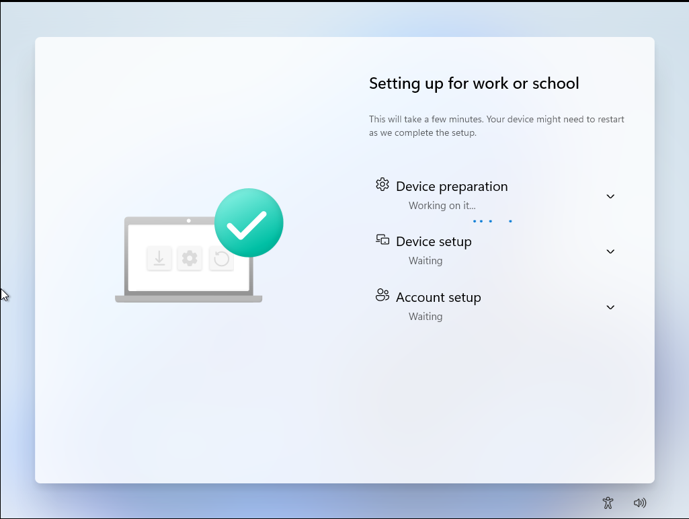<br><sub><b>Enrollment Status Page</b> during first sign-in</sub></td>
</tr>
<tr>
<td width="50%">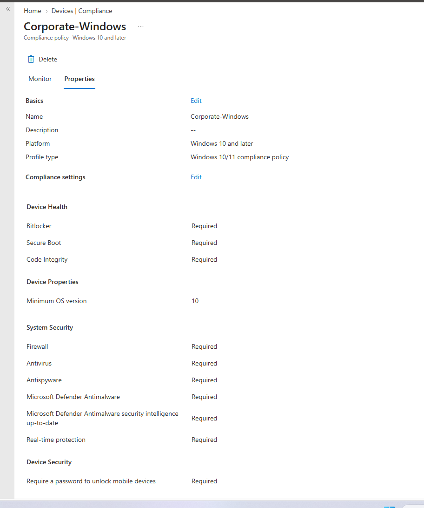<br><sub><b>Compliance policy</b></sub></td>
<td width="50%">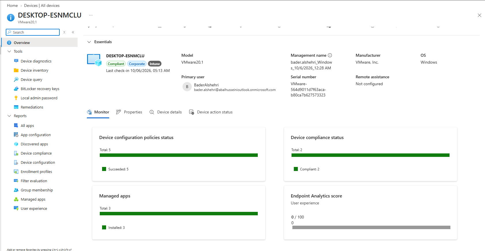<br><sub><b>Device status:</b> compliant</sub></td>
</tr>
<tr>
<td width="50%">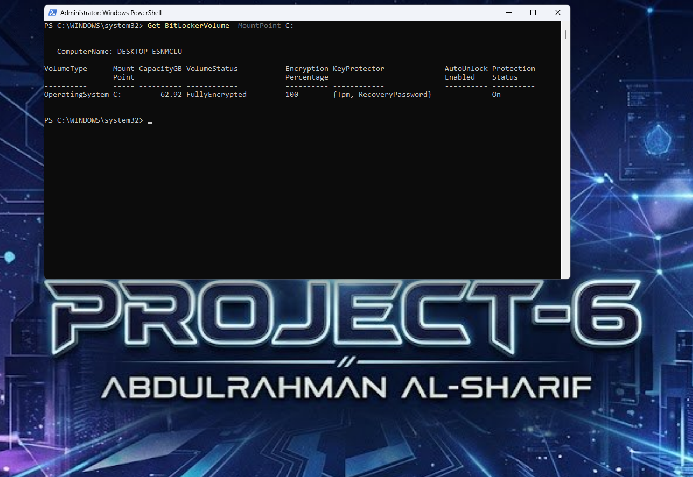<br><sub><b>BitLocker</b> encryption status</sub></td>
<td width="50%">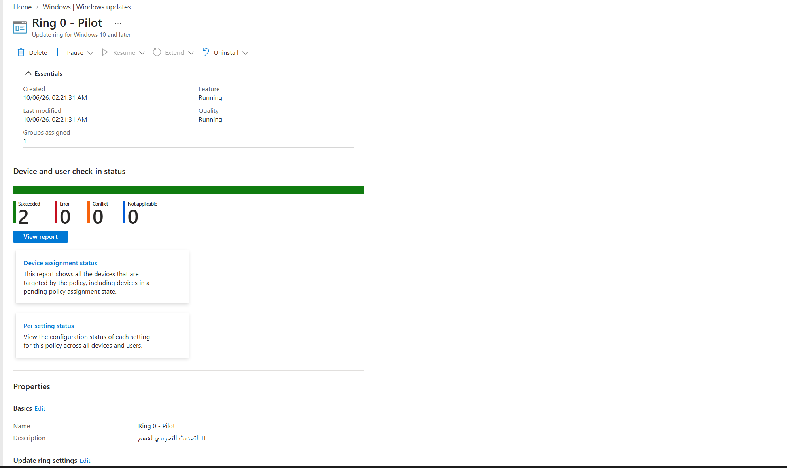<br><sub><b>Update rings</b> (phased rollout)</sub></td>
</tr>
<tr>
<td width="50%">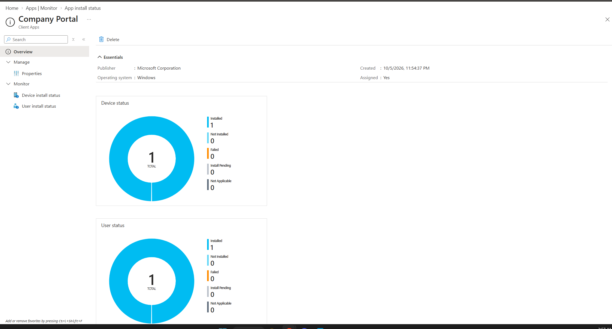<br><sub><b>Application deployment</b></sub></td>
<td width="50%">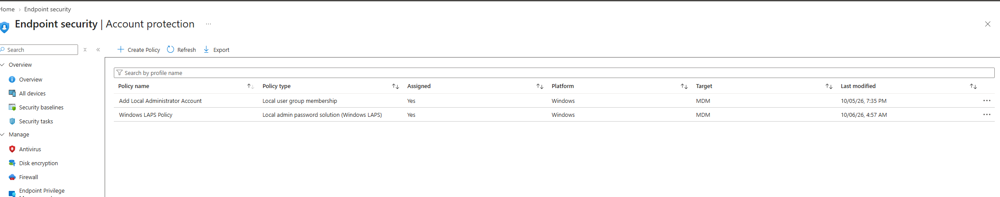<br><sub><b>Windows LAPS</b></sub></td>
</tr>
</table>

---

## Security Design Decisions

| Decision | Reason |
|---|---|
| Report-only first, then enforce | Avoids locking users out; What If validates impact |
| Break-glass account excluded from policies | Guarantees tenant access if a policy misfires |
| Least-privilege admin roles | Limits blast radius of compromised accounts |
| OU filtering in Entra Connect | Only intended objects reach the cloud |
| Recovery keys escrowed in Entra ID | Encrypted devices stay recoverable |
| Phased update rings | Bad updates are caught before reaching everyone |
| Devices without a compliance policy treated as non-compliant | Prevents unmanaged gaps |

---

## Challenges & Solutions

**Entra Connect failed at the application-based authentication step.**

- **Symptom:** the wizard stopped with "could not configure application-based authentication".
- **Diagnosis:** the trace logs showed `AADSTS700016`: the app registration was created but could not obtain a token because it was not found in the tenant.
- **Resolution:** cleaned up the failed registrations and re-ran the setup until the application and its service principal were created correctly. Delta sync now returns **Success**.
- **Lesson:** read the trace log for the actual error code instead of repeating the wizard.

**A newly enrolled device showed "not compliant".**

- **Cause:** no compliance policy was assigned to it, because the policy was targeted at a group the device was not in.
- **Fix:** adjusted the assignment so the policy reaches the device. Devices with no policy are treated as non-compliant by design.

---

## Skills Demonstrated

`Active Directory` · `Group Policy` · `Microsoft Entra ID` · `Entra Connect` · `Conditional Access` · `Microsoft Intune` · `Windows Autopilot` · `BitLocker` · `Windows LAPS` · `RBAC` · `Troubleshooting` · `Technical Documentation`

---

## Next Steps

- Microsoft Defender for Endpoint onboarding and device risk signal in compliance
- Privileged Identity Management (just-in-time admin roles)
- Identity Protection risk-based policies
- Password writeback

---

## Repository Structure

```
.
├── README.md
├── images/        # screenshots and architecture diagram
├── policies/      # exported Conditional Access / Intune JSON
└── scripts/       # PowerShell used to build the AD structure
```

---

## Author

**Abdulrahman AlSharif** · IT Infrastructure & Cloud Endpoint Management
[LinkedIn](https://linkedin.com/in/abdulrahmansa) · [GitHub](https://github.com/abd-alhusseini)

<sub>All screenshots are from a lab environment. Identifiers and secrets have been redacted.</sub>
